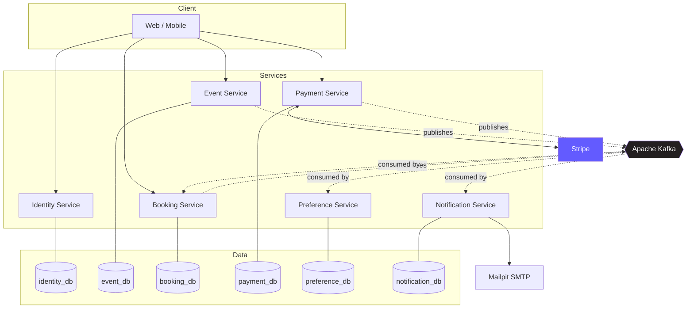
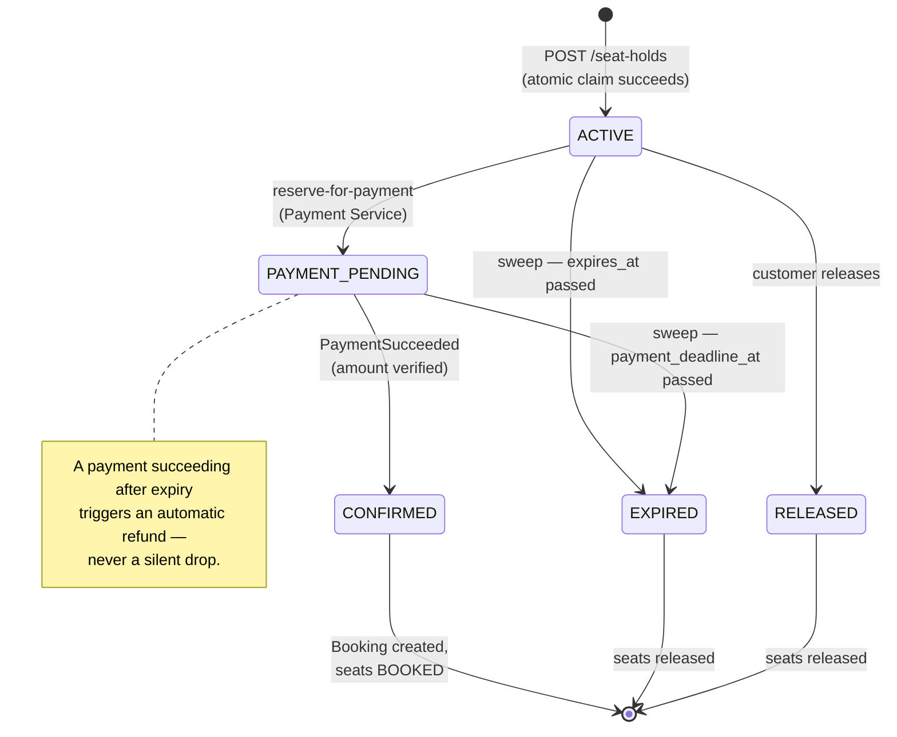
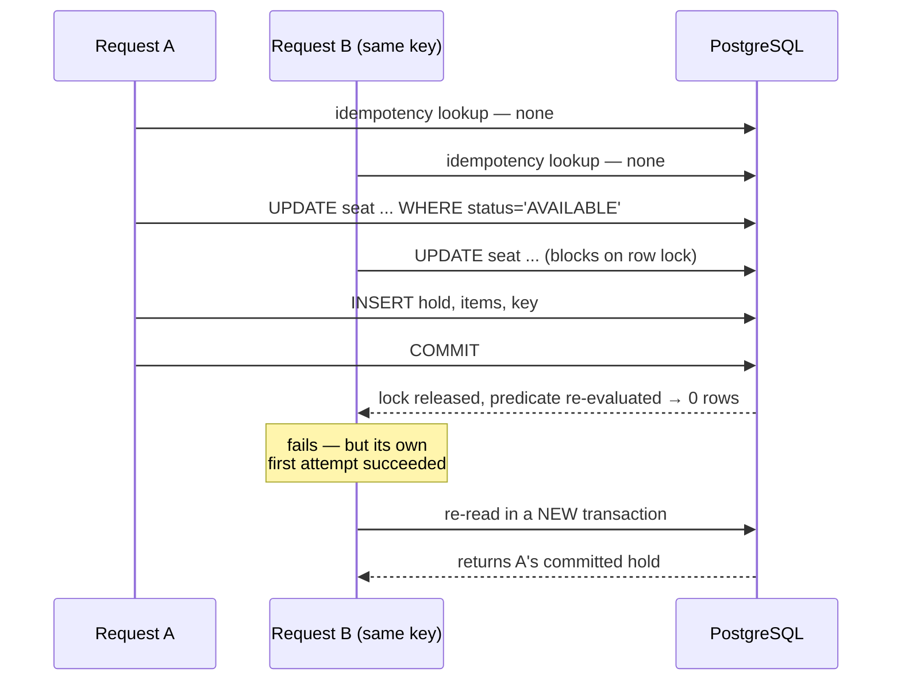

<div align="center">

# Event Ticket System

**A microservices ticketing platform built around the hard parts — concurrent seat allocation, distributed data ownership, and eventual consistency without distributed transactions.**

[](https://adoptium.net/)
[](https://spring.io/projects/spring-boot)
[](https://www.postgresql.org/)
[](https://www.docker.com/)

[](https://kafka.apache.org/)
[](https://redis.io/)
[](https://stripe.com/)
[](https://hibernate.org/)
[](https://testcontainers.com/)

</div>

---

## What it is

A microservices ticketing platform where customers hold assigned seats, pay, and get confirmed bookings. The interesting problem isn't CRUD — it's two thousand people claiming the same seat at once, a payment succeeding after its hold expired, or a service being unreachable mid-check. The project is built around those cases.

---

## Architecture

Six services, each owning its own database. **No shared tables, no cross-service foreign keys, no distributed transactions.**



| Service | Responsibility |
|:---|:---|
| **Event Service** | Events, categories, lifecycle (draft → published → cancelled → archived), search and filtering |
| **Booking Service** | Seats, seat holds, bookings — the concurrency-critical core |
| **Identity Service** | Registration, login, password hashing, JWT issuance, roles |
| **Payment Service** | Stripe PaymentIntents, webhook verification, refunds |
| **Preference Service** | Customer category preferences |
| **Notification Service** | Email delivery with retries and persistence |

Services communicate asynchronously through Kafka integration events. Synchronous calls exist only for rare, admin-time correctness checks — never on the seat-claiming or payment-processing hot paths.

---

## The seat hold lifecycle

The heart of the system. A hold is a short-lived, exclusive claim on specific seats.



---

## Engineering problems addressed

### Concurrent seat allocation without double-booking

> [!IMPORTANT]
> The central invariant: a seat can be held by at most one hold at a time, and a booked seat can never be re-held.

The mechanism is a single atomic conditional `UPDATE` where the `WHERE` clause is simultaneously the check and the guard:

```sql
UPDATE seat
SET status = 'HELD', active_hold_id = ?, hold_expires_at = ?, version = version + 1
WHERE event_id = ? AND id IN (?, ?, ...) AND status = 'AVAILABLE'
```

Comparing rows-affected against the number of seats requested tells you whether the claim fully succeeded. There is no window between reading status and writing it, so no time-of-check-to-time-of-use gap exists.

<details>
<summary><b>Why not pessimistic or optimistic locking?</b></summary>

<br>

**Pessimistic row locking** (`SELECT ... FOR UPDATE` then `UPDATE`) is correct and gives cleaner per-seat diagnostics, but requires two statements and holds locks longer.

**Optimistic locking with retry** thrashes precisely during the on-sale rush the system needs to handle well. A six-seat claim has a much higher collision probability than a single-row update.

Note that the chosen approach is *not* optimistic locking despite the version column:

| | Optimistic locking | Conditional update |
|:---|:---|:---|
| **Question asked** | "Has this row changed since I read it?" | "Is this row in the state I need?" |
| **Requires prior read** | Yes | No |
| **Predicate** | `WHERE version = ?` | `WHERE status = 'AVAILABLE'` |
| **Round trips** | Two | One |

The version increment exists so entity-managed writes elsewhere still interact correctly with rows changed by native queries.

</details>

### All-or-nothing multi-seat holds

A customer requesting seats A1, A2, A3 must receive **all three or none**. If rows-affected is less than requested, the entire transaction rolls back — including seats the same statement successfully claimed and the hold row itself. A follow-up query inside the transaction identifies which specific seats were lost, so the error response can name them.

### Idempotency, including the concurrent case

`POST /seat-holds` accepts an `Idempotency-Key` header. The straightforward part — a retry arriving after the original completed — is a lookup at the start of the transaction.

The hard case is two requests with the same key arriving **simultaneously**, which happens when a client retries after a network timeout while the original is still executing.



> [!NOTE]
> Recovering requires reading data the winning transaction just committed — impossible from inside a transaction already marked rollback-only. The retry logic must therefore sit **outside** the transaction boundary, in a separate bean, because a private method on the same bean would bypass Spring's transactional proxy and silently do nothing.

Only three exception types trigger the recovery path. Widening it further would mask genuine failures as successes.

### Service data ownership without distributed transactions

Booking Service needs to know whether an event is published and within its booking window. Calling Event Service synchronously would make the highest-traffic operation in the system depend on another service's availability.

Instead, Booking Service maintains a local `EventBookability` projection, kept current by consuming `EventPublished` / `EventCancelled` / `EventArchived` / `EventUpdated`. **The hot path reads only locally-owned data.**

Where synchronous calls genuinely are necessary — validating an event exists before creating seat inventory, checking for confirmed bookings before permitting a restricted edit — they are admin-time, low-frequency, and **fail closed**. If the dependency is unreachable, the operation returns `503` rather than proceeding on an assumption. Explicit connect and read timeouts make that failure fast rather than a hung thread.

### Money and eventual consistency

<details open>
<summary><b>Payment correctness rules</b></summary>

<br>

- A **Stripe webhook is the only authority** for payment success. Client-side confirmation never creates a booking.
- **Prices are snapshotted** at hold creation and carried forward to booking items — never recomputed from live seat prices, so a price change cannot retroactively alter what a customer agreed to pay.
- **Amount and currency are verified** against the hold's snapshot before a booking is confirmed.
- **Seats are released after cancellation only when the refund succeeds** — never on the cancellation request alone.

</details>

Late-arriving success signals — a payment succeeding after its deadline, after the hold expired, or after the event was cancelled — trigger **automatic compensating refunds** rather than being silently dropped. Money was genuinely charged, so something must genuinely give it back. This pattern recurs in three distinct places and is implemented as one rule rather than three.

### Invariants enforced by the database

Application checks provide clear error messages. Database constraints provide correctness. Where they overlap, **the constraint is the authority**.

| Invariant | Enforcement |
|:---|:---|
| One active hold per user per event | Partial unique index on `(user_id, event_id) WHERE status IN ('ACTIVE','PAYMENT_PENDING')` |
| At most one booking per hold | `UNIQUE(source_hold_id)` |
| One seat label per event | `UNIQUE(event_id, seat_label)` |
| Idempotency keys scoped per user | `UNIQUE(user_id, idempotency_key)` |
| Currency is EUR | `CHECK` on every monetary table |
| Valid status values | `CHECK ... IN (...)` mirroring each enum |

The "one active hold per user" pre-check in application code exists purely so the common case produces a readable error. Under true concurrency both requests pass that check and the index rejects one — which is why the corresponding test asserts on the resulting row count rather than on which exception was thrown.

### Hold expiration

Holds expire on a scheduled sweep rather than a cache TTL, because the database is the source of truth for inventory. Each hold expires in its own `REQUIRES_NEW` transaction so one problematic row cannot roll back a batch, and no transaction stays open for the whole sweep. Status is re-checked inside that transaction — the sweep's query result is a list of *candidates*, not a decision.

> [!TIP]
> A payment succeeding after expiry is deliberately **not** special-cased in the sweep. The compensating-refund path already covers it, so the sweep runs purely on timestamps without consulting Payment Service.

### Testing concurrency honestly

> [!WARNING]
> Concurrency tests that pass without ever creating contention are worse than no tests.

Two details make these real:

**No `@Transactional` on the test class.** Spring's test support wraps tests in a transaction and rolls back afterward — convenient, and fatal here. Every thread would join a single transaction and no two statements would ever contend. Cleanup is manual via `TRUNCATE` instead.

**A `CountDownLatch` start gate.** Threads submitted to an executor don't begin simultaneously; startup cost staggers them enough for one claim to commit before the next begins. All threads block on the gate and release together.

The suite covers:

| Scenario | Asserted outcome |
|:---|:---|
| 10 threads claim one seat | Exactly one wins, nine rejected |
| Overlapping seat sets `{A1,A2,A3}` vs `{A3,A4,A5}` | Loser holds **nothing**; A4/A5 stay `AVAILABLE` |
| Same user, different seats, same event | Partial unique index rejects one |
| Same idempotency key, concurrent | One hold created, both callers receive it |

---

## Technology stack

<details open>
<summary><b>Core</b></summary>

<br>

| Layer | Technology |
|:---|:---|
| **Language / build** | Java 17 (LTS, Eclipse Temurin), Maven |
| **Framework** | Spring Boot 4.1, Spring MVC, Spring Data JPA, Hibernate, Bean Validation, Spring Scheduling, Actuator |
| **Persistence** | PostgreSQL 16 (one database per service), Flyway, JPA Criteria API, native queries for atomic operations, UUID primary keys, `@Version` optimistic locking |
| **Messaging** | Apache Kafka, transactional outbox pattern, idempotent consumers |
| **HTTP client** | `RestClient` with explicit connect/read timeouts |

</details>

<details>
<summary><b>Payments, security, caching, notifications</b></summary>

<br>

| Concern | Technology |
|:---|:---|
| **Payments** | Stripe — PaymentIntents, idempotency keys, webhook signature verification |
| **Security** | Spring Security, JWT, BCrypt, role-based authorization |
| **Caching** | Redis — event detail and normalized search caching, TTL with jitter, generation-based invalidation. Added only after database behaviour is correct and measurable; **never** the source of truth for inventory |
| **Notifications** | Mailpit (local SMTP) with retry and persistence |

</details>

<details>
<summary><b>Testing and infrastructure</b></summary>

<br>

| Concern | Technology |
|:---|:---|
| **Testing** | JUnit 5, Testcontainers (real PostgreSQL, not an in-memory substitute), `@DataJpaTest` slice tests, `ExecutorService` + `CountDownLatch` concurrency tests |
| **Infrastructure** | Docker, Docker Compose, springdoc-openapi (Swagger UI) |

</details>

---

## Project status

Built in phases, each completed and verified before the next begins.

| Phase | Scope | Status |
|:---:|:---|:---:|
| **0** | State machines, invariants, service and event contracts | ✅ Complete |
| **1** | Event Service — entities, lifecycle, filtering, migrations, tests | ✅ Complete |
| **2** | Booking Service — seats, atomic holds, expiration, confirmation | ✅ Complete |
| **3** | Identity and JWT | 🔨 In progress |
| **4** | Kafka and transactional outbox | 📋 Planned |
| **5** | Payment Service and Stripe | 📋 Planned |
| **6** | Preference and Notification Services | 📋 Planned |
| **7** | Redis caching | 📋 Planned |
| **8** | Production engineering — gateway, observability, tracing, load and chaos testing | 📋 Planned |

Phase 0 produced a complete state-transition specification for Event, Seat, SeatHold, Payment, and Booking — every transition documented with trigger, authorization, preconditions, transaction boundary, related entity changes, emitted event, and duplicate/invalid behaviour. Implementation treats that document as the source of truth; where code and specification disagree, one of them is a bug.

---

## Running locally

**Prerequisites:** JDK 17 · Maven · Docker Desktop

```bash
# Start the databases
docker compose up -d

# Event Service → port 8080
cd event-service && mvn spring-boot:run

# Booking Service → port 8081
cd booking-service && mvn spring-boot:run
```

Swagger UI: [`localhost:8080/swagger-ui.html`](http://localhost:8080/swagger-ui.html) · [`localhost:8081/swagger-ui.html`](http://localhost:8081/swagger-ui.html)

Flyway applies migrations automatically at startup.

> [!NOTE]
> Until Phase 4 wires up Kafka, Booking Service's `event_bookability` projection has no live population path. To exercise seat holds locally, insert a row manually:
>
> ```sql
> INSERT INTO event_bookability
>     (event_id, status, booking_opens_at_utc, booking_closes_at_utc, start_time_utc)
> VALUES
>     ('<event-id>', 'PUBLISHED', now() - interval '1 day',
>      now() + interval '30 days', now() + interval '31 days');
> ```

### Tests

```bash
mvn test      # unit tests
mvn verify    # includes Testcontainers integration tests (requires Docker)
```

Integration tests are suffixed `IT`; unit tests are suffixed `Test`.

---

## Design decisions worth reading

<details>
<summary><b>Five choices that are deliberate rather than incidental</b></summary>

<br>

**Price range filtering matches an actual configured price tier**, not a min/max overlap check. An event with €20 and €200 tiers does not appear in a search for €50–€100 tickets, because no such ticket exists.

**Seat inventory is append-only** in the current version. Adding seat deletion would require a rule preventing removal of seats referenced by bookings — deferred rather than half-implemented.

**The 24-hour cancellation cutoff is plain UTC arithmetic**, not venue-local time. An easy rule to over-apply from the timezone handling used elsewhere in the system.

**`UNAVAILABLE` is an admin-only seat state**, independent of the booking and event lifecycle. Event cancellation returns seats to `AVAILABLE`, since the event's own status already blocks new holds.

**Boundary conditions are specified explicitly and tested** — whether a booking window is inclusive at open and exclusive at close, whether an event can be archived at exactly its end time. This is where off-by-one bugs live.

</details>
